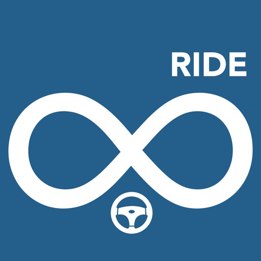
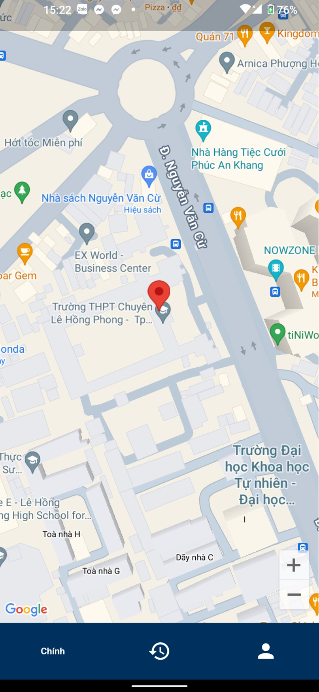
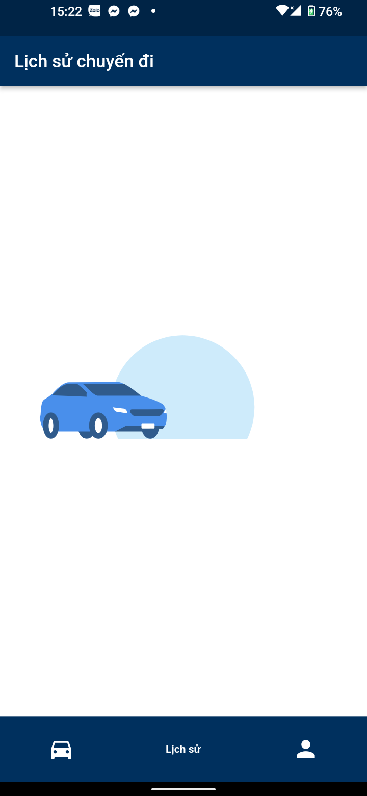
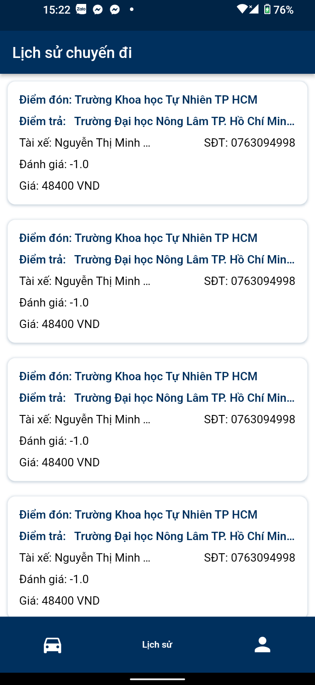
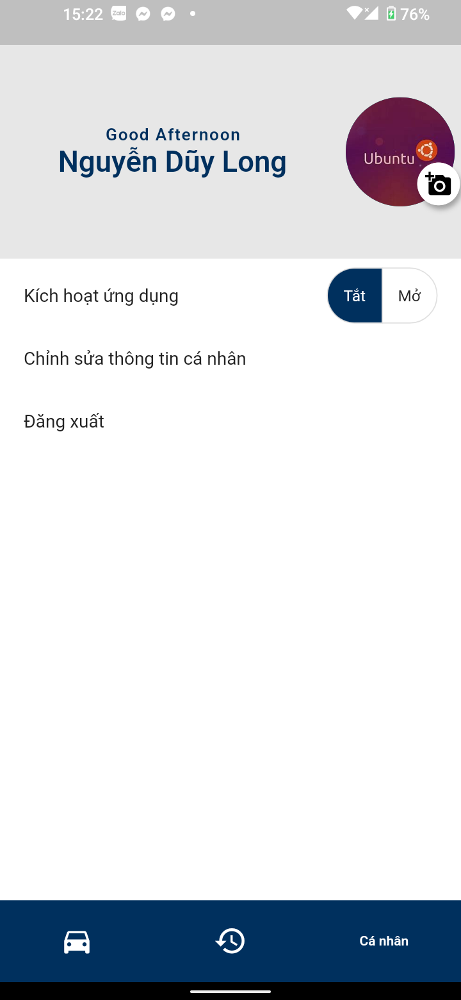
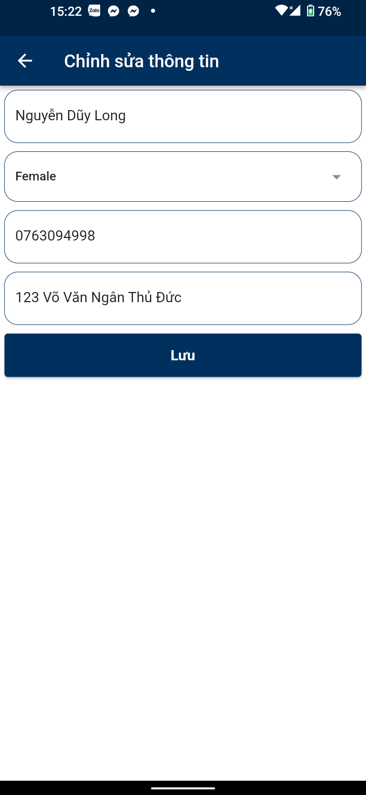

# RIDE BOOKING SYSTEM FOR DRIVER

A project to build an app ride booking for driver

## Getting Started
Make sure that you have installed dart and Flutter on your computer.
If you installed both, you just clone or download and run it like any other flutter project.
## Some image demo
<table width="100%">
  <tbody>
    <tr>
      <td width="1%"></td>
      <td width="1%"></td>
      <td width="1%"></td>
    </tr>
    <tr>
     <td width="1%"></td>
     <td width="1%"></td>
    </tr>
  </tbody>
</table>
